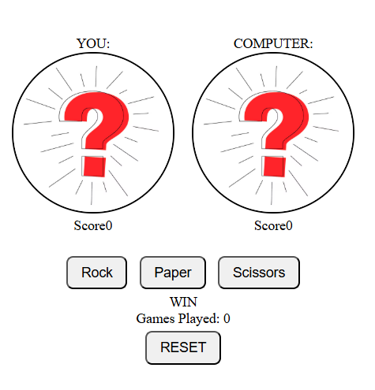
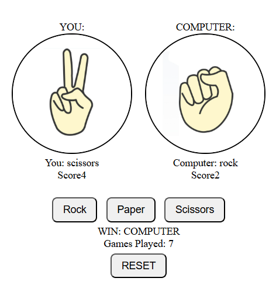

# Rock-Paper-Scissors-JS
A simple Rock Paper Scissors game built with vanilla JavaScript, HTML, and CSS

### Game Start / Reset
When the game starts or after pressing the **RESET** button, the interface looks like this:
  

---

### During Gameplay
Here is an example of the game in progress, showing the player’s choice, the computer’s choice, and the current scores:
  
