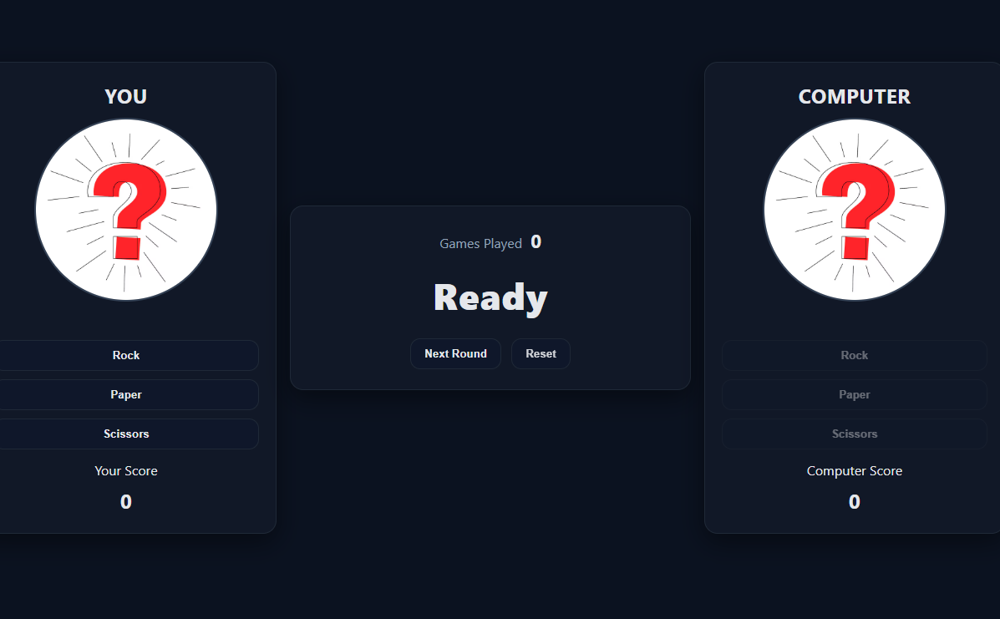
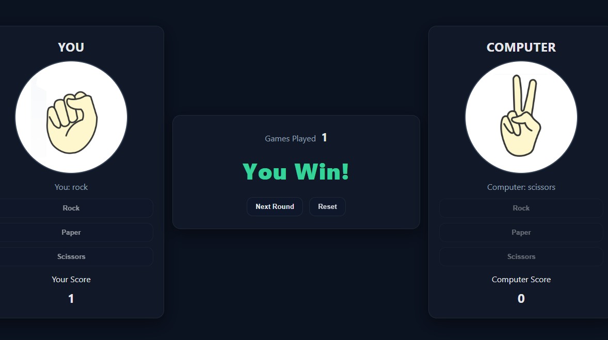
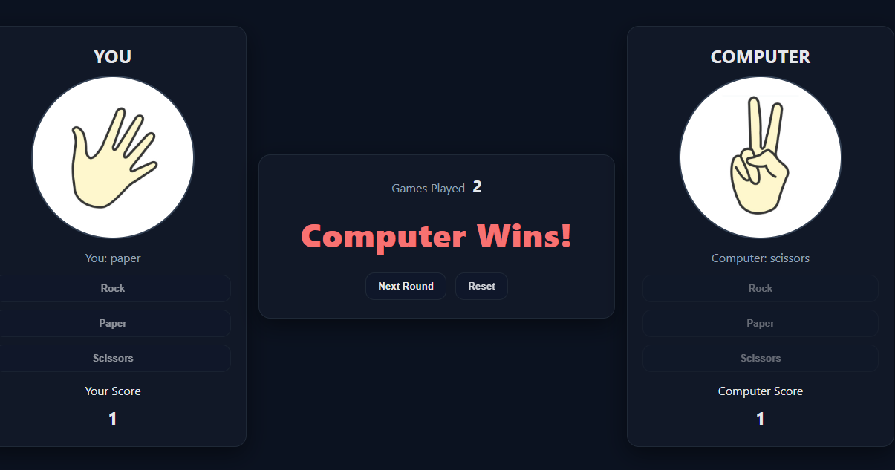
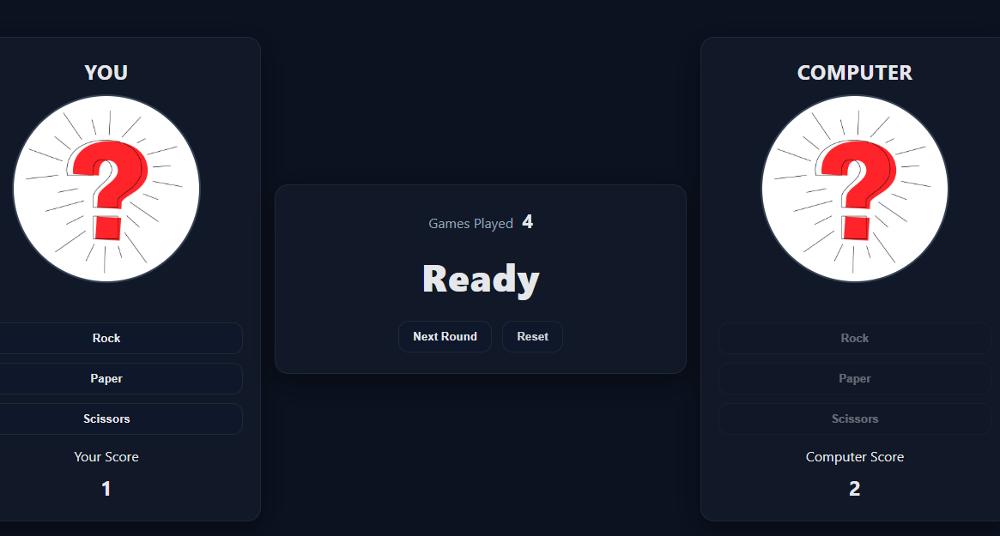

# Rock Paper Scissors (Vanilla JS)

A simple **Rock–Paper–Scissors** game built with **HTML, CSS, and JavaScript**.  
This is a browser-based mini project for practicing DOM manipulation, state handling, and UI design.

---

## 🎮 Features
- Play against the computer with Rock, Paper, or Scissors.
- Scores for **You** and **Computer** are tracked.
- Results are displayed clearly in the center (`You Win!`, `Computer Wins!`, `Tie`).
- **Games Played** counter in the middle of the screen.
- **Next Round** button to continue fairly (turn-based).
- **Reset** button clears all scores and starts fresh.
- Responsive design with clean UI.

---

### Game Start
  

---

### Gameplay – You Win
  

---

### Gameplay – Computer Wins
  

---

### Ready for Next Round
  
